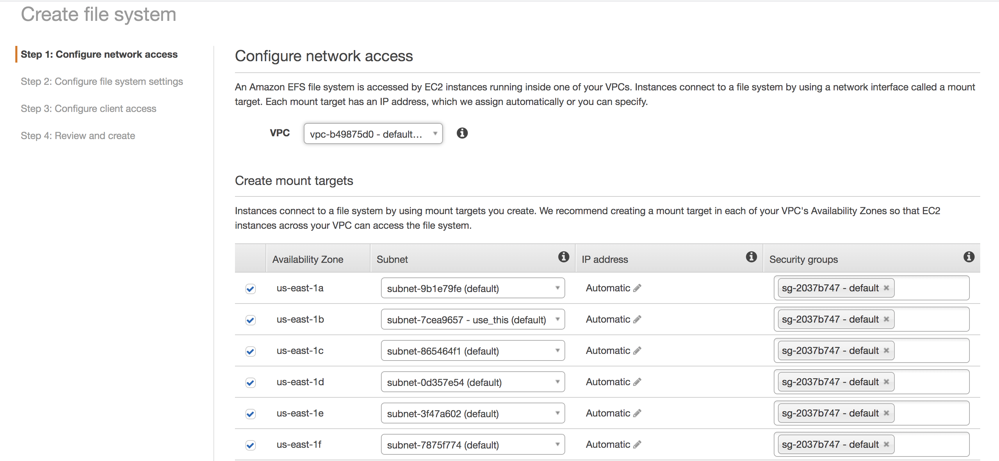
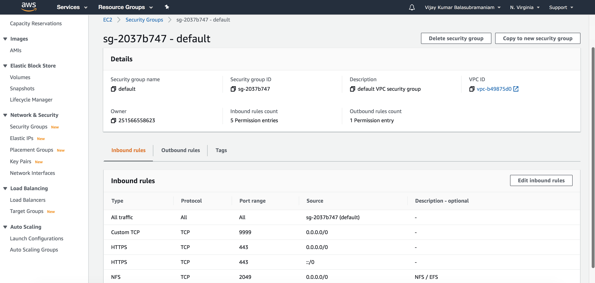
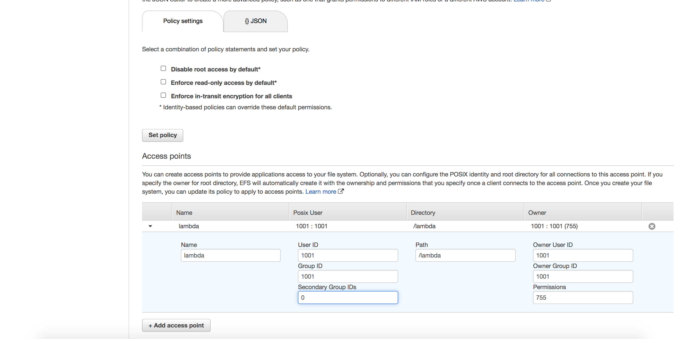

# chalice-efs-read-write

This project demonstrates how you can read and write files from EFS (AWS Elastic File System) in a chalice application

You can use Elastic File Storage to provide persistence for a Lambda function.

1. First create the EFS in the same VPC as the Lambda function and any EC2 instances that need access to it



2. Allow inbound access to NFS port 2049 in the security group



3. Create an access point that allow clients to connect. This will be used by the lambda function. Define the user 1001 as the owner with 755 permissions



4. Now you can mount this EFS into an EC2 instance by following the mount instructions provided by AWS

See [mount.sh](mount.sh)

5. The EC2 instance, create directories, group and user

```
# Create directories, group and user
cd /mnt/efs
sudo mkdir lambda
sudo groupadd -g 1001 lambda
sudo useradd -u 1001 -g 1001 lambda
# Setup ownership and contents
sudo chown lambda:lambda /mnt/efs/lambda
sudo su - lambda
cd /mnt/efs/lambda
echo "hello efs" >hello.txt
```

6. Create and deploy a lambda function using chalice

See [app.py](app.py)

See [deploy.sh](deploy.sh)

See the KB article "Lambda with EFS" for more details